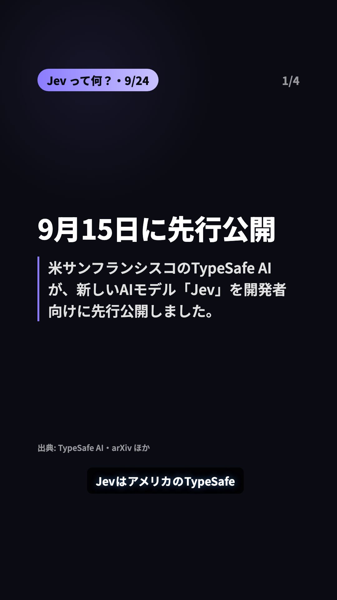
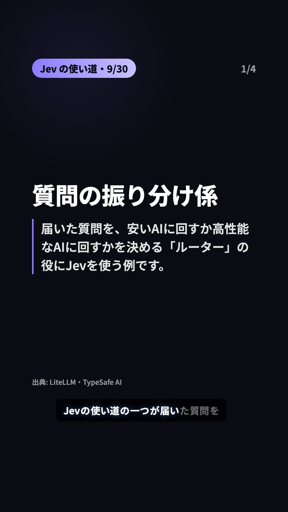

# Reels cover: before / after (2026-09-22)

Owner report: the Instagram profile grid showed the same picture every day, so
the account read as one repeated post instead of a daily series.

## Cause

The cover was pinned to the **opening title card**, twice over:

| Where | Value | Lands on |
|---|---|---|
| `daily-video.yml` / `post-today-instagram.yml` | `INSTAGRAM_THUMB_OFFSET_MS: "2000"` | opening |
| `pipeline.mjs` Step 4c | `remotion still --frame=60` | opening |

`MIN_OPENING_FRAMES = 90` (3.0 s) existed specifically to guarantee both landed
there. The opening card is brand-constant — "新作AIツール" + "N選" + the source
pill — and the only day-varying element on it is the 40 px date label.

This was never an Instagram API problem: `thumb_offset` **is** supported for
`media_type=REELS` ([IG User Media
reference](https://developers.facebook.com/docs/instagram-platform/instagram-graph-api/reference/ig-user/media/),
v25.0, checked 2026-09-22). It was doing exactly what it was told.

## Fix

`scripts/cover-frame.mjs` derives the cover point from the day's real audio
durations so it lands 2 s into the **first tool card**. The video is unchanged;
only the cover point moves.

## Before — every day the same

| 2026-09-18 | 2026-09-22 |
|---|---|
|  |  |

Identical apart from the date.

## After — the day's tool, same series look

| 2026-09-18 | 2026-09-22 | sample day, full `npm run dry-run` |
|---|---|---|
|  |  |  |

`AskDeck / スライドと解説動画を自動生成` vs `AppGrowthKit / アプリストア用の宣伝画像を自動で作成`
vs `Resurf / メモもリンクもPDFも1か所に保存` — three different strings, while the
`1/5` badge, the `新作AIツール 5選` band, the purple accent and the dark ground
keep the series recognisable.

## Reproducing

```sh
node scripts/preview-covers.mjs \
  data/enriched-ai-tools.json \
  data/samples/enriched-ai-tools.pickup.sample.json
# an older day:
git show <sha>:data/enriched-ai-tools.json > /tmp/day.json
```

Only two production days exist for this format (trial #1 started 2026-09-18;
09-19..09-21 were skip days), so the third image is the committed pickup
sample — rendered by the real pipeline (`npm run dry-run`, cover frame 168 from
the day's actual TTS durations), which is why it also carries the subtitle.

**All five images here are the text-only card.** `preview-covers.mjs` skips the
logo fetch, and the dry-run day had no logo either, so none of them show what a
production cover usually looks like: when a tool's logo or screenshot is
available, ToolCard puts the image above the name and steps the name down to
56-78 px, which is a visibly different layout from these. The image is one more
thing that differs per day — these previews understate the difference rather
than overstate it. The two `preview-covers.mjs` images also have no subtitle;
the dry-run one does, as production does.

## The recovery post

`post-today-instagram.yml` re-uploads an mp4 from a Release and has no audio
durations, so it cannot recompute the offset. `record-upload.mjs` stores the
day's `coverOffsetMs` in `data/performance-history.json` and
`scripts/cover-offset-for.mjs` reads it back.

A constant cannot stand in for it: `FALLBACK_OFFSET_MS` (5000 ms) is only
inside the first tool card while that day's opening narration was ≤ 4.5 s, and
`opening_narration` may be up to 30 characters (~5.7 s). Past that edge the
cover silently returns to the title card. `cover-offset-for.mjs` therefore
prints a loud warning whenever it has to fall back — which should only happen
for Releases cut before 2026-09-22.

## Jev format (genre trial #2, 2026-09-24)

Since 2026-09-24 the daily post is a Jev episode (`scripts/jev.mjs` →
`toJevVideoData`): opening (big "Jev" + the feature headline) → 3-4 slides →
ending. The slides sit in the same Series slot as the tool cards (audio
`tool-1..N`), so the same rule puts the cover on the **first slide**, whose
heading changes every day. Pinned by the Jev tests in `scripts/cover-frame.test.mjs`.

Made with `npm run dry-run:jev-intro` / `npm run dry-run:jev-usecase`; "before"
is the same props rendered at the old cover frame 60.

| | intro sample (cover frame 212) | usecase sample (cover frame 211) |
|---|---|---|
| before — opening |  |  |
| after — slide 1 |  |  |

Recovery fallback (both platforms failed that day, so no `coverOffsetMs` was
recorded): 5000 ms = frame 150. Jev hooks are 8-40 characters; both samples
read 4.51 s / 4.56 s, i.e. an opening of 151 / 152 frames, so frame 150 is the
last frame of the opening. On such a day the recovery post's cover is the
opening — it still carries that day's headline, so the tile is not identical
to other days, but it is not slide 1. `cover-offset-for.mjs` warns in the
run log. Left as is: it needs both uploads to fail on the same day, and
recording an entry for a day that posted nothing would feed the Jev ledger's
posted-history checks.
