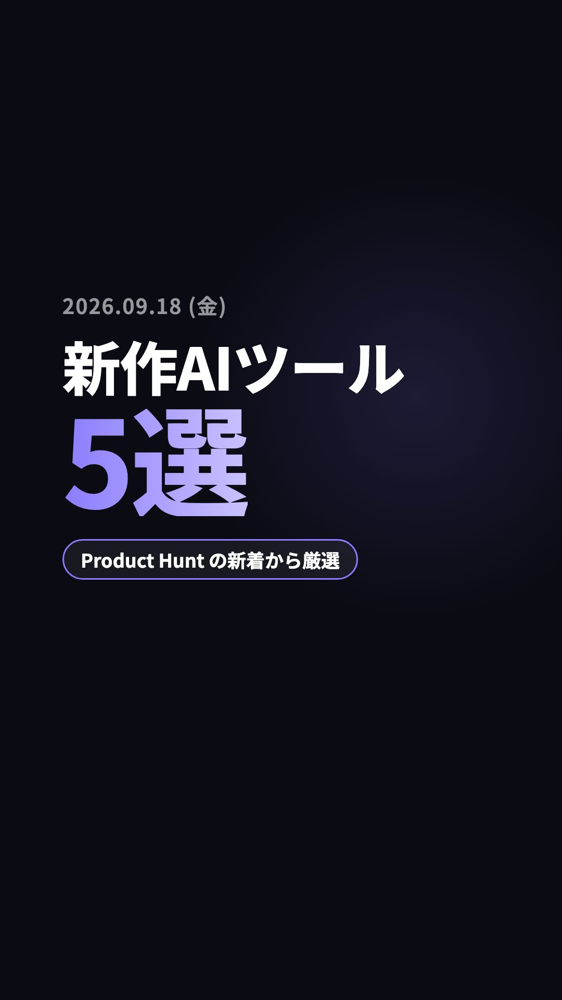
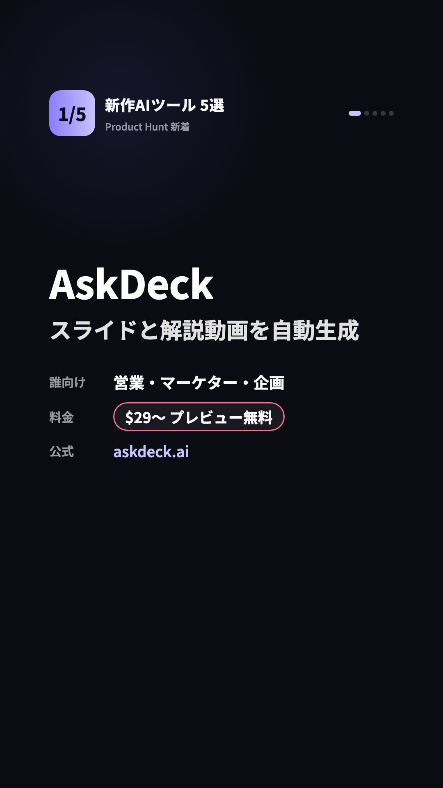
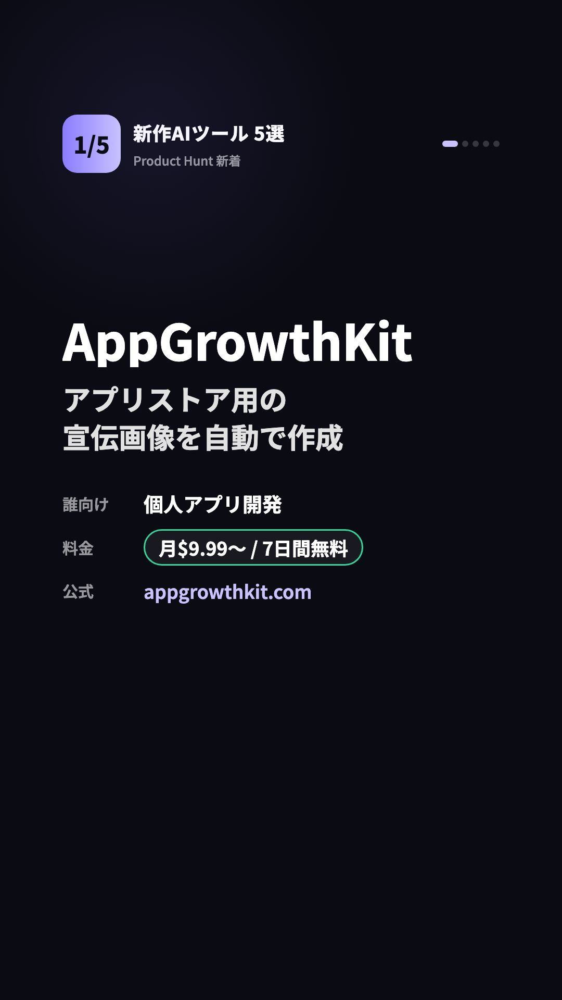
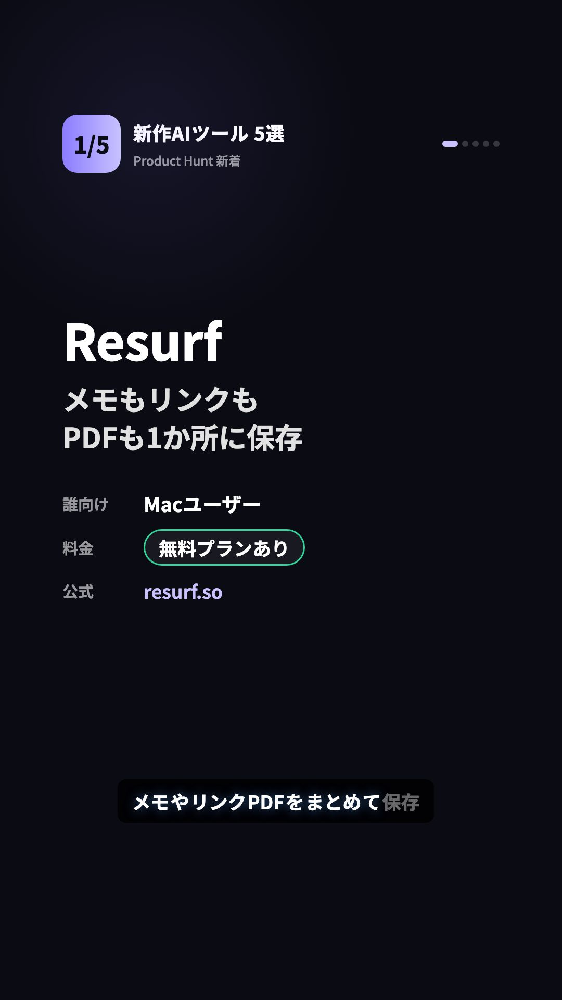

# Reels cover: before / after (2026-09-22)

Owner report: the Instagram profile grid showed the same picture every day, so
the account read as one repeated post instead of a daily series.

## Cause

The cover was pinned to the **opening title card**, twice over:

| Where | Value | Lands on |
|---|---|---|
| `daily-video.yml` / `post-today-instagram.yml` | `INSTAGRAM_THUMB_OFFSET_MS: "2000"` | opening |
| `pipeline.mjs` Step 4c | `remotion still --frame=60` | opening |

`MIN_OPENING_FRAMES = 90` (3.0 s) existed specifically to guarantee both landed
there. The opening card is brand-constant — "新作AIツール" + "N選" + the source
pill — and the only day-varying element on it is the 40 px date label.

This was never an Instagram API problem: `thumb_offset` **is** supported for
`media_type=REELS` ([IG User Media
reference](https://developers.facebook.com/docs/instagram-platform/instagram-graph-api/reference/ig-user/media/),
v25.0, checked 2026-09-22). It was doing exactly what it was told.

## Fix

`scripts/cover-frame.mjs` derives the cover point from the day's real audio
durations so it lands 2 s into the **first tool card**. The video is unchanged;
only the cover point moves.

## Before — every day the same

| 2026-09-18 | 2026-09-22 |
|---|---|
|  |  |

Identical apart from the date.

## After — the day's tool, same series look

| 2026-09-18 | 2026-09-22 | sample day, full `npm run dry-run` |
|---|---|---|
|  |  |  |

`AskDeck / スライドと解説動画を自動生成` vs `AppGrowthKit / アプリストア用の宣伝画像を自動で作成`
vs `Resurf / メモもリンクもPDFも1か所に保存` — three different strings, while the
`1/5` badge, the `新作AIツール 5選` band, the purple accent and the dark ground
keep the series recognisable.

## Reproducing

```sh
node scripts/preview-covers.mjs \
  data/enriched-ai-tools.json \
  data/samples/enriched-ai-tools.pickup.sample.json
# an older day:
git show <sha>:data/enriched-ai-tools.json > /tmp/day.json
```

Only two production days exist for this format (trial #1 started 2026-09-18;
09-19..09-21 were skip days), so the third image is the committed pickup
sample — rendered by the real pipeline (`npm run dry-run`, cover frame 168 from
the day's actual TTS durations), which is why it also carries the subtitle.

The two `preview-covers.mjs` images are rendered without logos and without
subtitles; production draws both, and each differs per day too.
